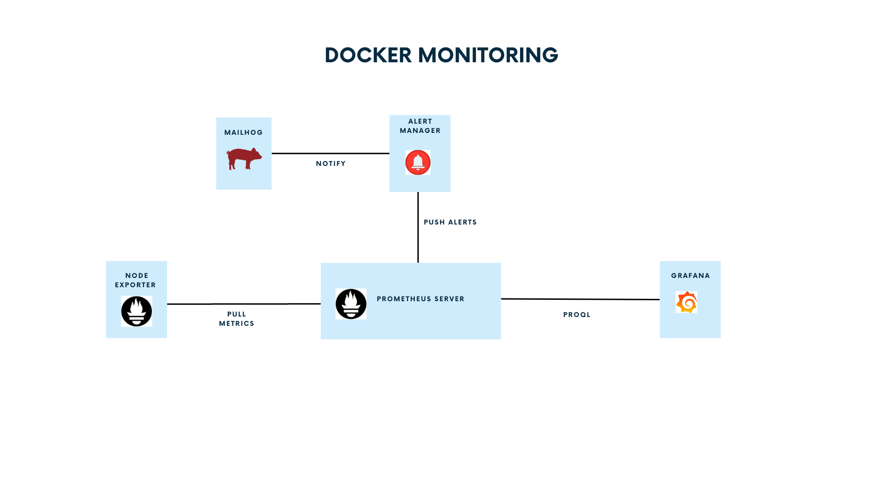

# Monitoring - Prometheus - Alertmanager - Grafana - Node Exporter - MailHog - NGINX




## Init

Add the hostname on the /etc/hosts

sudo vi /etc/hosts

#### Monitoring Hosts
````
127.0.0.1 nginx.acme.net
127.0.0.1 grafana.acme.net
127.0.0.1 prometheus.acme.net
127.0.0.1 alertmanager.acme.net
127.0.0.1 nodeexport.acme.net
127.0.0.1 mailhog.acme.net
127.0.0.1 services.acme.net
````

### Show Docker Composer

````
version: '3'

volumes:
  prometheus_data: {}  
  grafana-data: {}      

services:

### Virtual machine metrics - CPU, Memory, Network
  node-exporter:
    image: prom/node-exporter:latest
    container_name: node-exporter
    restart: unless-stopped
    volumes:
      - /proc:/host/proc:ro
      - /sys:/host/sys:ro
      - /:/rootfs:ro
    command:
      - '--path.procfs=/host/proc'
      - '--path.rootfs=/rootfs'
      - '--path.sysfs=/host/sys'
      - '--collector.filesystem.mount-points-exclude=^/(sys|proc|dev|host|etc)($$|/)'
    ports:
      - 9100

### Example to stop

  foobar-exporter:
    image: prom/node-exporter:latest
    container_name: foobar-exporter
    restart: unless-stopped
    volumes:
      - /proc:/host/proc:ro
      - /sys:/host/sys:ro
      - /:/rootfs:ro
    command:
      - '--path.procfs=/host/proc'
      - '--path.rootfs=/rootfs'
      - '--path.sysfs=/host/sys'
      - '--collector.filesystem.mount-points-exclude=^/(sys|proc|dev|host|etc)($$|/)'
    ports:
      - 9100
# Prometheus Server      
  prometheus:
    container_name: prometheus
    hostname: prometheus
    image: prom/prometheus
    volumes:
      - ./prometheus:/etc/prometheus/
      - prometheus_data:/prometheus
    command:
      - '--config.file=/etc/prometheus/prometheus.yml'
    ports:
      - 9090

# Grafana

  grafana:
    container_name: grafana
    hostname: grafana
    image: grafana/grafana
    ports:
      - 3000
    restart: unless-stopped
    volumes:
      - ./grafana/provisioning/:/etc/grafana/provisioning/
      - grafana-data:/var/lib/grafana
    env_file:
      - ./grafana/config.monitoring
  alertmanager:
    container_name: alertmanager 
    image: prom/alertmanager:v0.23.0
    restart: unless-stopped
    ports:
      - "9093"
    volumes:
      - "./alertmanager:/config"
    command: --config.file=/config/alertmanager.yaml --log.level=debug         

## receive the alert 

  mailhog:
      image: jcalonso/mailhog
      container_name: 'mailhog'
      ports:
        - "1025:1025"
        - "8025:8025"

#NGINX to Proxy

  app:
    image: 'jc21/nginx-proxy-manager:latest'
    ports:
      - '80:80'
      - '81:81'
      - '443:443'
    environment:
      DB_MYSQL_HOST: "db"
      DB_MYSQL_PORT: 3306
      DB_MYSQL_USER: "npm"
      DB_MYSQL_PASSWORD: "npm"
      DB_MYSQL_NAME: "npm"
    volumes:
      - ./nginx/data:/data
      - ./nginx/letsencrypt:/etc/letsencrypt
  db:
    image: 'jc21/mariadb-aria:latest'
    environment:
      MYSQL_ROOT_PASSWORD: 'npm'
      MYSQL_DATABASE: 'npm'
      MYSQL_USER: 'npm'
      MYSQL_PASSWORD: 'npm'
    volumes:
      - ./mysql/data/mysql:/var/lib/mysql  
  
# Dashboard to the Services

  heimdall:
    image: lscr.io/linuxserver/heimdall:latest
    container_name: heimdall
    environment:
      - PUID=1000
      - PGID=1000
      - TZ=US/Atlanta
    volumes:
      - ./heimdall/config:/config
    ports:
      - 80
      - 443
    restart: unless-stopped


````


#### Run the Application
`````
cd docker

docker compose up -d 
`````

#### Access to All the services 

http://services.acme.net


### Delete Node Exporter

`````
docker rm --force foobar-exporter 

`````

#### Delete All Application

`````
docker down
`````

## Services Description

### Prometheus

Prometheus collects and stores its metrics as time series data, i.e. metrics information is stored with the timestamp at which it was recorded, alongside optional key-value pairs called labels.

##### alert_rules.yaml 
````
## Add the alert rules to the prometheus 
groups:
#Name of the group
- name: node_exporter_alerts
  rules:
  # Name of the rule
  - alert: Node down
  # expression for validate 
    expr: up == 0
  # time to check the state  
    for: 10s
    # Info to  send with the email on alertmanager
    labels:
      severity: warning
    annotations:
      title: Node {{ $labels.instance }} is down
      description: Failed to scrape {{ $labels.job }} on {{ $labels.instance }} for more than 2 minutes. Node seems down.
````
##### prometheus.yaml
````
# my global config
global:
  scrape_interval: 15s # Set the scrape interval to every 15 seconds. Default is every 1 minute.
  evaluation_interval: 15s # Evaluate rules every 15 seconds. The default is every 1 minute.
  # scrape_timeout is set to the global default (10s).

# Alertmanager configuration
alerting:
  alertmanagers:
    - static_configs:
        - targets:
          - alertmanager:9093

# Load rules once and periodically evaluate them according to the global 'evaluation_interval'.
rule_files:
  - "alert_rules.yaml"
  # - "second_rules.yml"

# A scrape configuration containing exactly one endpoint to scrape:
# Here it's Prometheus itself.
scrape_configs:
  # The job name is added as a label `job=<job_name>` to any timeseries scraped from this config.
  - job_name: "prometheus"

    # metrics_path defaults to '/metrics'
    # scheme defaults to 'http'.

    static_configs:
      - targets: ["localhost:9090"]

  - job_name: "node-exporter"
    static_configs:
      - targets: ["node-exporter:9100"]
      - targets: ["foobar-exporter:9100"]      

  - job_name: "alertmanager"
    static_configs:
      - targets: ["alertmanager:9093"]
````

### AlertManager

Handles alerts sent by client applications such as the Prometheus server. It takes care of deduplicating, grouping, and routing them to the correct receiver integration such as email, PagerDuty, or OpsGenie. It also takes care of silencing and inhibition of alerts.

````
global:
  resolve_timeout: 5m
  # The smarthost and SMTP sender used for mail notifications.
  smtp_smarthost: 'mailhog:1025'
  smtp_from: 'alertmanager@example.org'
  smtp_require_tls: false

# The root route on which each incoming alert enters.
route:
  # The root route must not have any matchers as it is the entry point for
  # all alerts. It needs to have a receiver configured so alerts that do not
  # match any of the sub-routes are sent to someone.
  receiver: 'unmatched-default-root-route'

  # When a new group of alerts is created by an incoming alert, wait at
  # least 'group_wait' to send the initial notification.
  # This way ensures that you get multiple alerts for the same group that start
  # firing shortly after another are batched together on the first
  # notification.
  group_wait: 1s
  repeat_interval: 1s

receivers:
- name: 'unmatched-default-root-route'
  email_configs:
  - to: 'devopsteam@example.org'
    send_resolved: true

````


### Grafana
The open-source analytics & monitoring solution for every database.

##### Datasource
http://grafana.acme.net/datasources

````
datasources:
  - name: 'prometheus'
    type: 'prometheus'
    access: 'proxy'
    url: 'http://prometheus:9090'
````

````
user:admin
password:s0W#Pg562^YA
````
#### Node Exporter

Prometheus exporter for hardware and OS metrics exposed by *NIX kernels, written in Go with pluggable metric collectors.

#### MailHog

MailHog is an email testing tool for developers:

Configure your application to use MailHog for SMTP delivery
View messages in the web UI, or retrieve them with the JSON API
Optionally release messages to real SMTP servers for delivery

#### Nginx-Proxy-Manager
 
````

This project comes as a pre-built docker image that enables you to easily forward to your websites running at home or otherwise, including free SSL, without having to know too much about Nginx or Letsencrypt

user: acme@acme.net
password: s0W#Pg562^YA

````

## Prometheus Query

Now that we have at least 3 scrape targets, we can begin to run some more interesting queries that involve multiple scrape targets.

````
scrape_duration_seconds
````
This shows 3 time series results. 1 for each target,

we can filter for 1 target by including either the instance, or job labels
````
scrape_duration_seconds{instance="node-exporter:9100"}
````
Regular Expressions We can also use regular expressions. Go back to the console view and query for node_cpu_seconds_total We should get about 8 time series results. Lets filter for everything with mode containing irq
````
node_cpu_seconds_total{mode=~".*irq"}
````
All regular expressions in Prometheus use the re2 syntax.

Data Types Instant vector A set of time series containing a single sample for each time series, all sharing the same timestamp scrape_duration_seconds{instance="node-exporter:9100"}

Range Vector A set of time series containing a range of data points over time for each time series.

Return a whole range of scrape_duration_seconds (in this case 5 minutes) for the same vector, making it a range vector.
`````
node_netstat_Tcp_InSegs{instance="node-exporter:9100"}[5m] 

node_netstat_Tcp_InSegs{instance="node-exporter:9100"}[1m] 

node_netstat_Tcp_InSegs{instance="node-exporter:9100"}[30s]
`````
https://prometheus.io/docs/prometheus/latest/querying/functions/

Grafana Query to Prometheus Query

http://grafana.acme.net/d/rYdddlPWk/node-exporter-full?orgId=1&editPanel=20
````
(sum by(instance) (irate(node_cpu_seconds_total{instance="$node",job="$job", mode!="idle"}[$__rate_interval])) / on(instance) group_left sum by (instance)((irate(node_cpu_seconds_total{instance="$node",job="$job"}[$__rate_interval])))) * 100
````
http://prometheus.acme.net/graph?g0.expr=(sum%20by(instance)%20(irate(node_cpu_seconds_total%7Binstance%3D%22node-exporter%3A9100%22%2Cjob%3D%22node-exporter%22%2C%20mode!%3D%22idle%22%7D%5B5m%5D))%20%2F%20on(instance)%20group_left%20sum%20by%20(instance)((irate(node_cpu_seconds_total%7Binstance%3D%22node-exporter%3A9100%22%2Cjob%3D%22node-exporter%22%7D%5B5m%5D))))%20*%20100&g0.tab=0&g0.stacked=0&g0.show_exemplars=0&g0.range_input=1h

````
(sum by(instance) (irate(node_cpu_seconds_total{instance="node-exporter:9100",job="node-exporter", mode!="idle"}[5m])) / on(instance) group_left sum by (instance)((irate(node_cpu_seconds_total{instance="node-exporter:9100",job="node-exporter"}[5m])))) * 100
````


